<!--
Prithvi Reference-Data Assessment — Objective 1, Task 1 Report

This is the polished, human-facing report source. It is a separate
deliverable from notebooks/reference_data_assessment.ipynb, which remains
the detailed, reproducible analytical source of truth. Detailed geometry
repair, debugging, HUC investigations, and implementation QA stay in the
notebook/repo and are not duplicated here except where a specific result is
necessary to understand this report.

Main narrative (Sections 1-8) and Appendix A are complete and approved
(2026-09-24). See Appendix A for the reproducibility trail and the
References section for source-document citations.
-->

# Reference Data Assessment for Prithvi-Based Landscape Change Attribution

**Objective 1, Task 1**

**Project:** Prithvi-Based Landscape Change Attribution Service in Support of National Park Service and National Forest Monitoring Needs

Oregon State University
September 2026

---

## 1. Executive Summary

This report summarizes the reference data available to support development and evaluation of a Prithvi-based landscape change attribution service for National Park Service and U.S. Forest Service monitoring applications. The assessment is the first task under the project's initial objective and is intended to characterize the existing reference information before focal study areas and modeling experiments are selected.

Four reference-data sources were evaluated: landscape-change attribution data from the North Coast and Cascades Network (NCCN), Great Lakes Inventory and Monitoring Network (GLKN), and U.S. Forest Service Aerial Detection Survey (ADS) data for Regions 6 and 10. Together, these datasets represent different landscapes, time periods, disturbance processes, and approaches to identifying and attributing landscape change.

The assessment characterizes each source in its native form and summarizes attributed change using a consistent 30 m reference grid. Published change polygons were evaluated by subregion, year, and native attribution class to quantify the amount, composition, and temporal distribution of available reference information. Source-specific study areas and analysis boundaries were used to document the geographic context of the datasets but were not used to clip published reference labels. Unlabeled portions of those study areas were not interpreted as stable or no-change observations.

The four sources provide substantial but heterogeneous reference information for subsequent model development. They differ considerably in geographic extent, temporal coverage, attribution taxonomy, class prevalence, and the occurrence of multiple simultaneous attributions. These differences are important considerations for selecting focal study areas and designing subsequent Prithvi experiments. This assessment therefore preserves each source's native attribution system rather than imposing a common change taxonomy at this stage.

The results establish a documented reference-data foundation for the next phase of the project: identifying representative focal domains, defining modeling constraints and success criteria, and developing the experimental design for Prithvi-based change attribution.

---

## 2. Reference Data and Assessment Methods

### 2.1 Reference-data sources

This assessment evaluates four existing sources of landscape-change attribution data: the National Park Service North Coast and Cascades Network (NCCN), the Great Lakes Inventory and Monitoring Network (GLKN), and U.S. Forest Service Aerial Detection Survey (ADS) data for Regions 6 and 10. These datasets differ substantially in geographic extent, temporal coverage, methods of change detection and interpretation, and the terminology used to describe change.

Each source was therefore assessed independently and in its native attribution system. Change classes were not harmonized across datasets during this stage of the project. The objective was to characterize the reference information that is actually available—including its quantity, spatial and temporal distribution, and attribution structure—before making decisions about focal study areas or a common modeling taxonomy.

### 2.2 Study areas and subregions

Each reference source was organized into geographic subregions appropriate to that dataset. NCCN and GLKN were summarized by park or monitoring area, ADS Region 6 by EPA Level III ecoregion, and ADS Region 10 by HUC6 watershed.

Where authoritative source-specific study or analysis boundaries were available, these boundaries were used to describe the geographic context in which the reference data were developed. For NCCN, the appropriate study-area generation was associated with each generation of the published reference data. For GLKN, the LandTrendr analysis areas provide the corresponding study-area boundaries.

These study areas are distinct from the attributed change data themselves. Study-area boundaries describe where an analysis was conducted; published attributed polygons provide the reference labels used in this assessment. Published polygons were therefore retained in their complete form rather than clipped to nominal study-area boundaries. This preserves documented cases in which reference polygons legitimately cross those boundaries.

Similarly, areas within a study boundary that do not contain an attributed polygon were not assumed to represent stable or unchanged conditions. Absence of an attribution in these datasets is not, by itself, evidence of no change.

### 2.3 30 m reference-grid characterization

Published attributed polygons were converted to a consistent 30 m reference grid to provide a common spatial unit for quantitative characterization. A pixel was assigned an attribution when its center fell within the corresponding polygon (all_touched=False). Grid alignment was anchored deterministically to 30 m multiples of the native coordinate-system origin so that repeated processing of a source produces the same pixel alignment.

Coordinate systems appropriate to each region were retained: EPSG:26910 for NCCN, ESRI:102039 for GLKN and ADS Region 6, and EPSG:3338 for ADS Region 10.

The resulting grid is a project-defined reference grid used for Task 1 characterization. It should not be interpreted as the final Prithvi, HLS, or Landsat sampling grid. Alignment with the imagery-ingestion and chip-generation framework will be established during subsequent experimental design and model development.

Rasterization was performed independently for each native attribution class. Consequently, where a source contains multiple valid attributions for the same location and year, those labels are retained rather than forcing the pixel into a single mutually exclusive class.

### 2.4 Quantitative measures

The fundamental quantity used in the assessment is the number of attributed 30 m reference-grid pixels. Each pixel represents 900 m², or 0.09 ha, allowing pixel counts to be expressed as an equivalent pixel-derived area.

Temporal summaries use attributed pixel-years. A physical location attributed in more than one year contributes once for each year in which an attribution occurs. Thus, all-years totals describe the amount of reference information represented through space and time rather than the unique physical area affected at least once.

Native-class distributions are summarized using spatial prevalence. For a given subregion and year, spatial prevalence is the percentage of unique attributed reference-grid pixels carrying a particular native attribution class. All-years summaries use attributed pixel-years as the corresponding denominator.

Because multiple valid attributions can occur at the same location and time, class prevalence percentages are not constrained to sum to 100%. This is particularly relevant for ADS, where overlapping observations are part of the source-data structure, and for GLKN when secondary and tertiary attributed agents are considered.

In the spatial-prevalence heatmaps, cell color represents spatial prevalence; the numeric text in a cell is an annotation added for readability and is not itself an indication of whether a class is present. NCCN and GLKN (Figures 2 and 5) annotate every nonzero prevalence value, so a displayed 0 represents a small nonzero value that rounds to 0% at the displayed precision, while an unannotated, zero-valued cell indicates no rasterized representation in the plotted summary. ADS Region 6 and Region 10 (Figures 8 and 12) annotate only prevalence values greater than 5%, because those heatmaps are considerably denser; a colored cell without a number in those two figures can therefore represent a nonzero prevalence of 5% or less, not necessarily absence.

### 2.5 Native attribution systems and interpretation

The assessment preserves the attribution terminology supplied by each source. NCCN is characterized using its native landscape-change classes. GLKN uses the primary attributed change agent for the principal assessment while retaining secondary and tertiary agents as additional attribution information. ADS Regions 6 and 10 are characterized primarily using Damage Causal Agent (DCA) information, with Damage Type retained as a complementary, broader description of observed damage.

These source-specific classes describe different kinds and levels of information and are not assumed to be directly equivalent. For example, a landscape-change class from NCCN and a causal-agent attribution from ADS may both provide useful training information while representing different concepts. Cross-source class harmonization is therefore deferred until the project's focal domains and modeling objectives have been defined.

The resulting summaries are intended to describe the availability and structure of existing reference information, not to rank subregions or identify a preferred modeling location. Focal-domain selection and the definition of model training, validation, and evaluation samples are subsequent project decisions.

---

## 3. North Coast and Cascades Network (NCCN)

### 3.1 Source and reference data

The North Coast and Cascades Network (NCCN) reference data consist of human-interpreted landscape-change polygons developed through the National Park Service Vital Signs Monitoring program. For Mount Rainier National Park (MORA), North Cascades National Park Complex (NOCA), and Olympic National Park (OLYM), candidate disturbance patches were generated using LandTrendr-based spectral change detection and subsequently reviewed and assigned change classes by interpreters (NCCN, Antonova & Copass, 2022). These data represent attributed change patches rather than a wall-to-wall classification of landscape condition; areas without an attributed polygon therefore cannot be assumed to represent stable or unchanged conditions.

The current MORA, NOCA, and OLYM datasets cover 1987–2017. The Lewis and Clark National Historical Park (LEWI) dataset represents an earlier implementation and covers 1985–2011 (Copass & Antonova, 2019). LEWI also differs in schema and attribution terminology and is therefore retained as a distinct component of the NCCN reference-data collection rather than treated as directly equivalent to the three later datasets.

Across the four NCCN subregions, the assessment includes 12,630 attributed records representing 16 native change classes. Rasterization to the 30 m reference grid produced approximately 1.13 million attributed pixel-years, equivalent to approximately 101,734 ha of pixel-derived attributed area.

**Table 1. Summary of NCCN reference data**

| Records | Years | Subregions | Native classes | Attributed pixel-years | Pixel-derived area (ha) |
|---|---|---|---|---|---|
| 12,630 | 1985–2017 | 4 | 16 | 1,130,380 | 101,734.2 |

### 3.2 Study areas and data coverage

NCCN reference data span two generations of study-area design. The current MORA, NOCA, and OLYM datasets correspond to the later Protected Areas study areas, which focus the analysis on NPS lands and U.S. Forest Service wilderness areas. LEWI corresponds to the earlier NCCN analysis-area generation, which incorporated a broader buffered study area. Earlier NOCA and OLYM V2B datasets (Antonova, Copass, & Clary, 2013) were evaluated during data preparation but were not included in the Task 1 assessment because they represent the superseded analysis generation.

The authoritative study-area boundaries show close correspondence with the published attributed data for NOCA, OLYM, and LEWI. Approximately 98.1% of NOCA attributed area, 97.8% of OLYM attributed area, and 99.9% of LEWI attributed area falls within the corresponding study areas. MORA has lower containment, at approximately 88.2%.

The MORA difference is primarily associated with the 2017 fire attribution. The source methodology documents that these fire patches were intentionally retained beyond the nominal study-area boundary. Clipping the reference data to the Protected Areas boundary would remove approximately 14% of MORA's Fire-class reference pixels and nearly 12% of its total attributed pixel-years. The complete published fire geometries were therefore retained in this assessment, consistent with the treatment of authoritative study areas as geographic context rather than label boundaries.

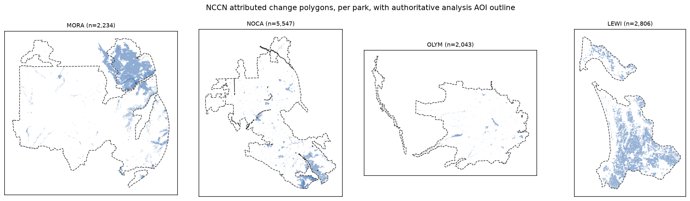

**Figure 1. NCCN attributed landscape-change polygons by subregion.** Full attributed dataset per park (MORA, NOCA, OLYM, LEWI). The dashed outline is each subregion's authoritative analysis AOI (Table 2), not a park administrative boundary; attributed polygons are not clipped to it and may extend outside, most visibly for MORA (88.2% of attributed area within the AOI; see Section 3.2).

**Table 2. NCCN authoritative study areas and reference-data containment**

| Park | Dataset | Generation | Authoritative study area | Study-area extent (ha) | % of attributed area within study area |
|---|---|---|---|---|---|
| MORA | MORA_1987_2017_V2_1_1 | Later (Protected Areas) | MORA Protected Areas | 180,527.6 | 88.2% |
| NOCA | NOCA_1987_2017_V2_1_1 | Later (Protected Areas) | NOCA Protected Areas | 644,344.4 | 98.1% |
| OLYM | OLYM_1987_2017_V2_1_1 | Later (Protected Areas) | OLYM Protected Areas | 403,911.9 | 97.8% |
| LEWI | LEWI_1985_2011_Report | Original (buffered study area) | LEWI study area (north + south) | 70,852.5 | 99.9% |

### 3.3 Native change-class distribution

The composition of the NCCN reference data varies substantially among parks. Fire is the dominant attributed class in MORA and NOCA, accounting for approximately 74% and 82% of attributed pixel-years, respectively. Defoliation provides the second-largest component in both parks.

OLYM contains a more varied mixture of attributed processes. Fire remains the largest class at approximately 53%, but Riparian Change, Avalanche, Blowdown, and Mass Movement provide substantial additional reference information. LEWI differs markedly from the other NCCN datasets: Clearing accounts for approximately 79% of its attributed pixel-years, followed primarily by Windthrow Salvage and Tree Toppling.

These differences also reflect the distinct attribution vocabularies and histories of the source datasets. Although 16 native classes occur across NCCN as a whole, most are relatively uncommon, and individual parks generally contain only a small number of classes representing substantial portions of their attributed reference information.

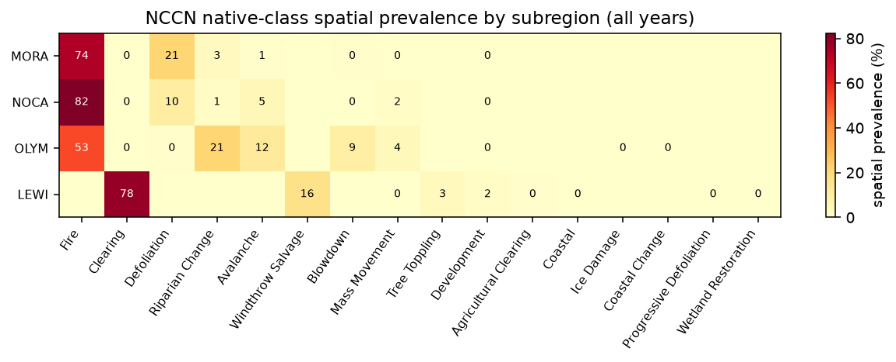

**Figure 2. Spatial prevalence of native NCCN change classes by subregion.** All years combined; percentages are not constrained to sum to 100% (Section 2.4). Cell color represents spatial prevalence. All nonzero values are annotated; a displayed 0 indicates a small nonzero prevalence that rounds to 0% at the displayed precision, while an unannotated zero-valued cell indicates no rasterized representation in the plotted summary.

### 3.4 Temporal distribution

NCCN reference information is also unevenly distributed through time. In MORA and NOCA, the high overall prevalence of Fire is strongly influenced by individual event years rather than a consistent annual background of fire attribution. MORA is particularly influenced by the 2017 fire event, while NOCA contains prominent fire attribution in 2001 and 2015.

LEWI shows a different temporal pattern. Clearing remains comparatively persistent across its 1985–2011 record rather than being concentrated in a small number of event years. These temporal differences are important because aggregate class prevalence alone can obscure whether reference information represents recurring change processes or a small number of large events.

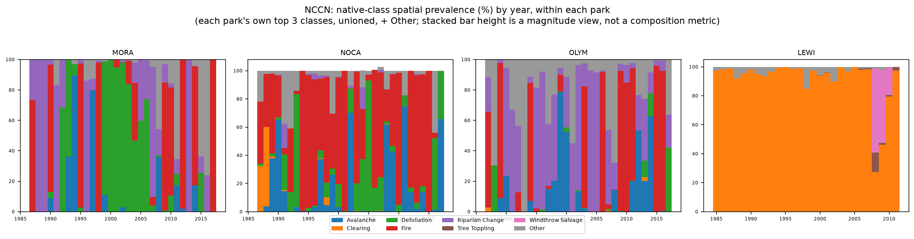

**Figure 3. Temporal distribution of native NCCN change classes by subregion.** Each panel shows that subregion's own top 3 classes (unioned across parks) plus an "Other" category; stacked bar height is a magnitude view, not a composition metric.

### 3.5 Considerations for downstream use

NCCN provides a substantial collection of human-interpreted landscape-change reference data spanning multiple disturbance processes and more than three decades. The data also illustrate several considerations for subsequent model development.

Class availability is strongly uneven among both parks and years, with several dominant classes driven by individual disturbance events. LEWI represents a different generation of analysis and uses a substantially different attribution vocabulary from the later MORA, NOCA, and OLYM datasets. These distinctions should be retained when constructing subsequent training and evaluation samples rather than assuming that all NCCN observations are interchangeable.

Same-year multiple attribution is uncommon in NCCN, occurring in approximately 0.12% of attributed pixels. The source datasets' minimum mapping unit also results in negligible loss of attributed polygons under the pixel-center rasterization approach used for this assessment.

Finally, NCCN should not be interpreted as providing explicit no-change reference data. The datasets consist of interpreted candidate change patches, and locations without an attributed polygon have not been established as stable observations. Construction of change/no-change training or evaluation samples will therefore require an explicit strategy during subsequent experimental design.

---

## 4. Great Lakes Inventory and Monitoring Network (GLKN)

### 4.1 Source and reference data

The Great Lakes Inventory and Monitoring Network (GLKN) reference data consist of interpreted landscape-disturbance polygons developed through the network's LandTrendr-based monitoring program. The dataset covers seven National Park Service units: Apostle Islands National Lakeshore (APIS), Indiana Dunes National Park (INDU), Isle Royale National Park (ISRO), Mississippi National River and Recreation Area (MISS), Saint Croix National Scenic Riverway (SACN), Sleeping Bear Dunes National Lakeshore (SLBE), and Voyageurs National Park (VOYA).

GLKN uses Landsat time-series segmentation with LandTrendr to identify candidate disturbance patches. Candidate polygons are subsequently reviewed by interpreters using higher-resolution imagery to determine whether a disturbance occurred and, for confirmed disturbances, to assign one or more causal agents (Kirschbaum, 2024). Of 177,153 candidate polygons in the source database, 53,665 were confirmed as disturbances and are included in this assessment. The remaining candidates were rejected during interpretation and are not treated as either disturbance or no-change reference observations.

The confirmed reference data span 1990–2021 and contain 10 observed primary-agent classes. Rasterization to the 30 m reference grid produced approximately 4.08 million attributed pixel-years, equivalent to approximately 367,013 ha of pixel-derived attributed area.

**Table 3. Summary of GLKN reference data**

| Records | Years | Subregions | Native classes | Attributed pixel-years | Pixel-derived area (ha) |
|---|---|---|---|---|---|
| 53,665 | 1990–2021 | 7 | 10 | 4,077,926 | 367,013.3 |

### 4.2 Study areas and data coverage

Authoritative LandTrendr analysis areas are available for each of the seven GLKN parks represented in the reference dataset. Source metadata confirm that these boundaries correspond to the areas used for the underlying LandTrendr analyses rather than boundaries developed retrospectively for this assessment.

Agreement between the analysis areas and the published reference data is essentially complete. All attributed pixel-years for APIS, INDU, MISS, SACN, SLBE, and VOYA fall within their corresponding analysis areas. ISRO has 99.99% containment, with only 173 of approximately 1.29 million attributed pixel-years extending beyond the analysis boundary.

As with NCCN, the analysis-area boundaries are used here to document the geographic context of the source data rather than to redefine the published labels. The complete attributed geometries are retained for the quantitative assessment.

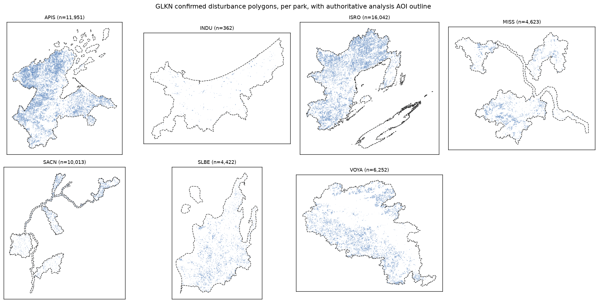

**Figure 4. GLKN confirmed disturbance polygons by subregion.** Full confirmed-disturbance dataset per park. The dashed outline is each subregion's authoritative LandTrendr analysis AOI (Table 4), not a park administrative boundary; attributed polygons are not clipped to it. Containment is essentially complete for all seven parks (100.0%, or 99.99% for ISRO; see Section 4.2), so little to no attributed area falls outside the outline shown.

**Table 4. GLKN LandTrendr analysis areas and reference-data containment**

| Park | LandTrendr analysis area extent (ha) | Attributed pixel-years | % within analysis area |
|---|---|---|---|
| APIS | 309,668.9 | 1,173,708 | 100.0% |
| INDU | 164,188.0 | 15,111 | 100.0% |
| ISRO | 433,334.5 | 1,290,342 | 99.99% |
| MISS | 205,138.4 | 201,939 | 100.0% |
| SACN | 367,270.0 | 547,861 | 100.0% |
| SLBE | 238,259.2 | 195,965 | 100.0% |
| VOYA | 519,535.7 | 653,000 | 100.0% |

### 4.3 Native change-agent distribution

The composition of GLKN reference information varies substantially among parks. Forest harvest is the most prevalent primary agent in five of the seven parks. It accounts for approximately 49% of attributed pixel-years in APIS and ISRO, 76% in SACN, 60% in SLBE, and 87% in VOYA.

Insect/disease defoliation is also a major component of the reference information in APIS and ISRO, accounting for approximately 45% and 46% of attributed pixel-years, respectively. These two parks therefore contain a substantially different mixture of reference information than SACN, SLBE, and VOYA, where harvest is more strongly dominant.

Development dominates the two remaining parks, accounting for approximately 77% of attributed pixel-years in INDU and nearly 99% in MISS. Across GLKN as a whole, forest harvest and insect/disease defoliation account for most of the attributed reference information, while the remaining native agents occur much less frequently.

The observed data contain 10 primary-agent values. Nine correspond to the controlled vocabulary documented in GLKN's source metadata; a tenth, flooding, occurs as a primary attribution in 55 confirmed records. Because flooding occurs directly in the source data and was not introduced during processing, it is retained as a native class in this assessment.

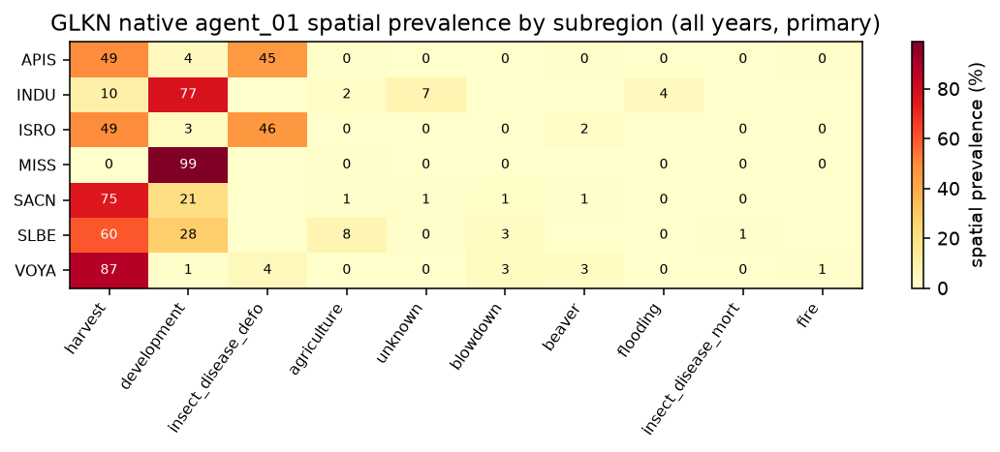

**Figure 5. Spatial prevalence of primary GLKN change agents by subregion.** All years combined, primary (agent_01) view; percentages are not constrained to sum to 100% (Section 2.4). Cell color represents spatial prevalence. All nonzero values are annotated; a displayed 0 indicates a small nonzero prevalence that rounds to 0% at the displayed precision, while an unannotated zero-valued cell indicates no rasterized representation in the plotted summary.

### 4.4 Temporal distribution

The temporal composition of GLKN reference information also differs among parks. In APIS and ISRO, forest harvest and insect/disease defoliation vary in relative prevalence through time rather than one agent consistently dominating the entire record. In contrast, development remains comparatively persistent in INDU and MISS across their represented years.

These patterns demonstrate that the overall agent distributions summarize reference information that is not uniformly distributed through time. Both the dominant process and the amount of attributed information available for a particular process can vary substantially by park and year.

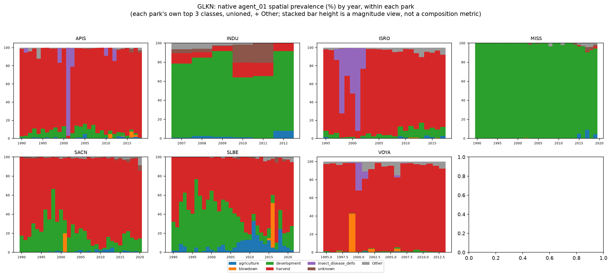

**Figure 6. Temporal distribution of primary GLKN change agents by subregion.** Each panel shows that park's own top 3 agents (unioned across parks) plus an "Other" category; stacked bar height is a magnitude view, not a composition metric.

### 4.5 Primary and additional attributed agents

GLKN allows interpreters to record as many as three causal agents for a confirmed disturbance. The primary assessment uses agent_01, which provides one primary attribution for each confirmed disturbance. Secondary and tertiary agents were evaluated separately to determine how much additional attribution information they provide.

Including agent_02 and agent_03 does not expand the spatial or temporal footprint of the reference dataset: both the primary-only and all-agents views contain the same 4,077,926 attributed pixel-years. Instead, the additional fields provide secondary labels at locations already represented by a primary agent. When all attributed agents are retained, approximately 1.66% of attributed pixels carry more than one agent label.

This distinction allows the primary-agent view to provide a consistent basis for descriptive summaries while preserving secondary and tertiary agent information for later modeling decisions.

### 4.6 Considerations for downstream use

GLKN provides a comparatively large set of manually reviewed disturbance references distributed across seven park units and more than three decades. The combination of automated candidate detection and subsequent human interpretation provides explicit causal-agent information for confirmed disturbance patches.

The reference information is nevertheless strongly uneven among parks and agents. Several parks are dominated by forest harvest, APIS and ISRO contain substantial insect/disease defoliation information, and development accounts for most attributed information in INDU and MISS. These differences should be considered when subsequent training and evaluation samples are constructed.

The distinction between candidate and confirmed disturbance polygons is also important. Nearly 70% of the original LandTrendr candidate polygons were rejected during interpretation. These rejected candidates are not equivalent to an independently established stable or no-change class and are therefore excluded from the attributed reference summaries presented here.

Finally, the additional agent_02 and agent_03 fields provide potentially useful multi-agent information without expanding the underlying reference footprint. Whether those additional labels should be incorporated into model training or retained for evaluation is a subsequent experimental-design decision.

---

## 5. U.S. Forest Service Aerial Detection Survey — Region 6

### 5.1 Source and reference data

The U.S. Forest Service Aerial Detection Survey (ADS) provides annual observations of visible forest damage collected as part of the national Forest Health Detection Survey program. Aerial survey is the primary collection method, with trained observers mapping the location, extent, and apparent cause of forest damage from aircraft. The national program also incorporates ground-based observations and, increasingly, remote-sensing approaches.

ADS is designed as a broad-scale detection and reporting system rather than a complete inventory of forest condition (USDA Forest Service, 2025). Mapped damage therefore represents observed and attributed conditions within the survey program, while the absence of a damage polygon cannot by itself be interpreted as evidence of no damage.

The Region 6 dataset used in this assessment contains 911,911 damage records after excluding a small number of records assigned to other Forest Service regions. It spans every year from 1997 through 2025. Damage Causal Agent (DCA) is used as the primary attribution system for Task 1, with 91 DCA classes represented in the Region 6 assessment. Rasterization to the 30 m reference grid produced approximately 196.4 million attributed pixel-years, equivalent to approximately 17.67 million ha of pixel-derived attributed area.

**Table 5. Summary of ADS Region 6 reference data**

| Records | Years | Subregions | Native classes (DCA) | Attributed pixel-years | Pixel-derived area (ha) |
|---|---|---|---|---|---|
| 911,911 | 1997–2025 | 7 | 91 | 196,383,063 | 17,674,475.7 |

### 5.2 Analysis subregions and geographic coverage

For this assessment, ADS Region 6 observations were summarized within seven EPA Level III ecoregions spanning the project area: Blue Mountains, Cascades, Eastern Cascades Slopes and Foothills, Coast Range, North Cascades, Northern Rockies, and Klamath Mountains/California High North Coast Range.

These ecoregions provide a consistent set of project analysis subregions but should not be interpreted as historical ADS survey-area boundaries. The boundaries were adopted from the existing BugNet Region 6 analysis framework, and their correspondence to the original annual ADS survey extents has not been established.

Approximately 97.0% of the attributed area in the Region 6 source data intersects the seven analysis subregions, while approximately 3.0% falls outside them. The quantitative subregion summaries therefore characterize most, but not all, of the Region 6 reference dataset.

Because ADS observations recur annually, cumulative attributed area should not be interpreted as unique physical area affected over the full record. The same location may legitimately be mapped in multiple years, and cumulative attributed pixel-years can consequently exceed the physical area of an ecoregion.

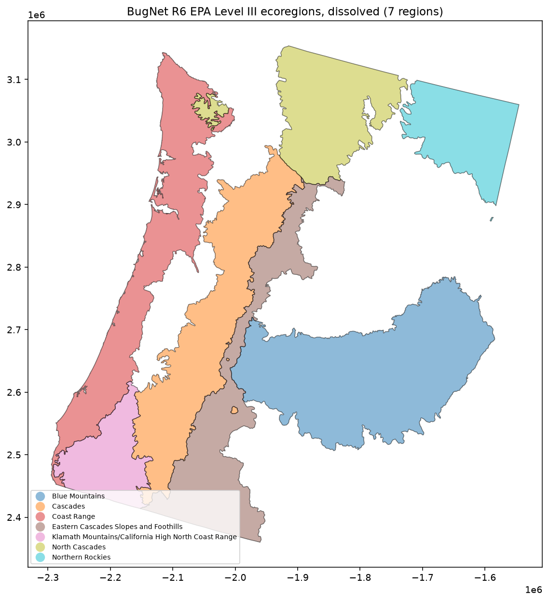

**Figure 7. ADS Region 6 observations and project analysis subregions.** The seven dissolved EPA Level III ecoregions used as Task 1 analysis subregions.

### 5.3 Damage Causal Agent distribution

Damage Causal Agent provides the most detailed attribution system evaluated for ADS Region 6. Ninety-one DCA classes are represented, but their spatial prevalence is highly uneven. Dataset-wide, mountain pine beetle, fir engraver, and western spruce budworm together account for more than half of attributed pixel-years, while most individual DCA classes are comparatively uncommon.

The dominant agents also vary substantially among ecoregions. Mountain pine beetle is particularly prevalent in the Eastern Cascades Slopes and Foothills, Cascades, and Northern Rockies. Fir engraver is prominent in the Blue Mountains and several interior ecoregions, while western spruce budworm is a major component of the North Cascades and Eastern Cascades Slopes and Foothills.

Other agents are strongly associated with particular portions of the Region 6 assessment. Swiss needle cast accounts for approximately 45% of attributed pixel-years in the Coast Range, while flatheaded fir borer accounts for approximately half in the Klamath Mountains/California High North Coast Range. Bear-associated damage is also prominent, ranking second in spatial prevalence in both the Cascades and Coast Range.

These patterns illustrate that the Region 6 reference dataset contains substantial geographic structure in both the amount and type of attributed forest damage.

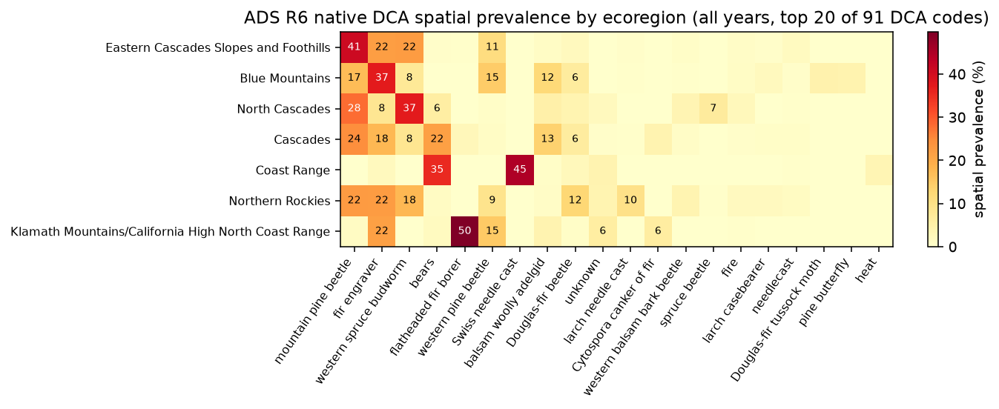

**Figure 8. Spatial prevalence of ADS Region 6 Damage Causal Agents by ecoregion.** All years combined, top 20 of 91 DCA classes shown for legibility; percentages are not constrained to sum to 100% (Section 2.4). Cell color represents spatial prevalence. Numeric annotations are shown only for values greater than 5%; therefore, colored cells without a number can represent nonzero prevalence of 5% or less.

### 5.4 Temporal distribution

The amount and composition of ADS Region 6 reference information vary considerably through time. Annual mapped damage is present throughout the 1997–2025 record, with moderate year-to-year variation through much of the earlier period followed by substantially greater mapped area during 2021–2023. The largest annual mapped area occurs in 2022.

Individual causal agents also show temporally concentrated patterns. For example, mountain pine beetle becomes substantially more prevalent in the Eastern Cascades Slopes and Foothills and Cascades during the early 2020s relative to its longer-term representation. As with the other reference sources, all-years summaries therefore combine disturbance information that may be concentrated within particular multi-year episodes.

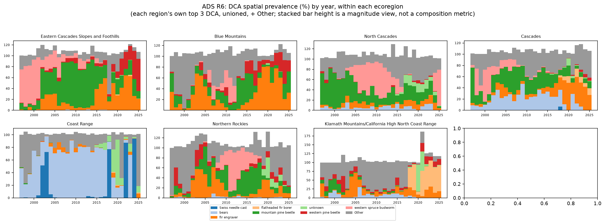

**Figure 9. Temporal distribution of ADS Region 6 Damage Causal Agents.** Each panel shows that ecoregion's own top 3 DCA classes (unioned across ecoregions) plus an "Other" category; stacked bar height is a magnitude view, not a composition metric.

### 5.5 Damage Type as a complementary attribution

ADS also records Damage Type, a broader description of the observed effect on vegetation. Sixteen Damage Type classes are represented in the Region 6 data. This field provides information complementary to DCA: DCA describes the attributed causal agent, while Damage Type describes the broader form of damage observed.

Mortality is the dominant Damage Type across the Region 6 dataset. Compared with DCA, the Damage Type distribution is less differentiated geographically and provides a coarser characterization of the available reference information. For this reason, DCA is used as the primary taxonomy for the Task 1 quantitative summaries, while Damage Type is retained as an additional source attribute that may be useful in subsequent model design.

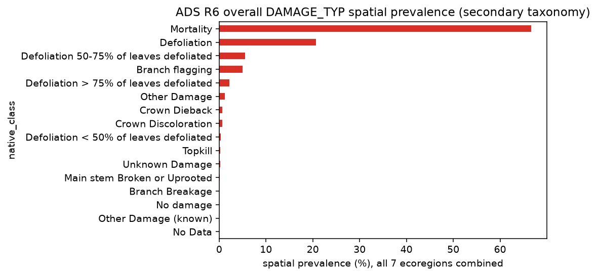

**Figure 10. Overall spatial prevalence of ADS Region 6 Damage Types.** All 7 ecoregions combined; secondary taxonomy, complementary to DCA.

### 5.6 Overlapping observations and rasterization

ADS contains more same-year overlapping attribution than the NCCN or GLKN reference datasets. Approximately 8.2% of attributed Region 6 reference-grid pixels carry more than one DCA attribution within the same year.

Detailed examination of the source geometries shows that most same-year overlap reflects the structure of ADS observations themselves: multiple attributed observations can share the same or overlapping mapped footprint. These overlapping observations were therefore preserved rather than forced into a single mutually exclusive class. As a result, DCA spatial-prevalence percentages within an ecoregion may sum to more than 100%.

The pixel-center rasterization approach can omit very small ADS geometries that do not contain a 30 m reference-grid pixel center. Among 2,342 small polygons specifically evaluated for this condition, 1,361 polygons within the assessed subregions contained no pixel center. This behavior reflects the interaction between small source geometries and the project-defined reference grid rather than removal of a particular attribution class.

### 5.7 Considerations for downstream use

ADS Region 6 provides by far the largest collection of attributed reference observations assessed to this point, spanning 29 years and a broad range of causal agents. Its annual structure and detailed DCA taxonomy provide extensive information on the spatial and temporal distribution of observed forest damage.

Several characteristics will require consideration during subsequent model design. DCA classes are strongly imbalanced, with a small number of agents accounting for a large share of the available reference information. The dominant agents also vary geographically and temporally, meaning that sampling decisions will influence the mixture of processes represented during training and evaluation.

ADS geometry should additionally be interpreted in the context of the survey method. Aerially mapped boundaries are observational representations of visible damage rather than precise ground-surveyed disturbance boundaries, and mapping style can vary among observers. Same-year overlapping observations and small mapped features are also inherent characteristics of the source data rather than conditions that can simply be removed without changing the information represented.

Finally, the Region 6 polygon dataset used here does not provide an explicit annual survey-extent or no-damage layer. Locations without mapped damage therefore cannot be treated as confirmed stable or no-change observations, or assumed to have been surveyed in a given year, based on this dataset alone.

---

## 6. U.S. Forest Service Aerial Detection Survey — Region 10

### 6.1 Source and reference data

The U.S. Forest Service Aerial Detection Survey (ADS) Region 10 data represent the Alaska portion of the same national Forest Health Detection Survey program described for Region 6. The dataset consists of annually collected observations of visible forest damage attributed to causal agents by the survey program. As with Region 6, these observations are intended for broad-scale detection and reporting rather than as a complete inventory of forest condition (USDA Forest Service, 2025).

The Region 10 source data were provided as a File Geodatabase and contain 151,309 attributed damage records. All records are identified as Region 10 observations, so no regional filtering was required. The data span every year from 1997 through 2025.

For the quantitative HUC6 assessment, 67 Damage Causal Agent (DCA) classes are represented. Rasterization to the 30 m reference grid produced approximately 95.7 million attributed pixel-years, equivalent to approximately 8.61 million ha of pixel-derived attributed area.

**Table 6. Summary of ADS Region 10 reference data**

| Records | Years | Subregions | Native classes (DCA) | Attributed pixel-years | Pixel-derived area (ha) |
|---|---|---|---|---|---|
| 151,309 | 1997–2025 | 20 | 67 | 95,700,410 | 8,613,036.9 |

### 6.2 Analysis subregions and geographic coverage

For this assessment, Region 10 observations were summarized within 20 HUC6 watershed basins adopted from the existing BugNet Region 10 analysis framework. These watersheds provide geographically meaningful project analysis units across Alaska but should not be interpreted as historical ADS survey-area boundaries. Their correspondence to the complete geographic extent of annual ADS surveying has not been established.

Approximately 90.5% of the attributed area in the Region 10 source data intersects these 20 HUC6 basins, while approximately 9.5% falls outside them. The HUC6 summaries therefore characterize most, but not all, of the Region 10 reference dataset. This uncaptured portion is larger than in the Region 6 assessment and should be considered when interpreting the quantitative summaries.

As with Region 6, repeated annual observations mean that cumulative attributed pixel-years represent reference information through both space and time rather than unique physical area affected at least once.

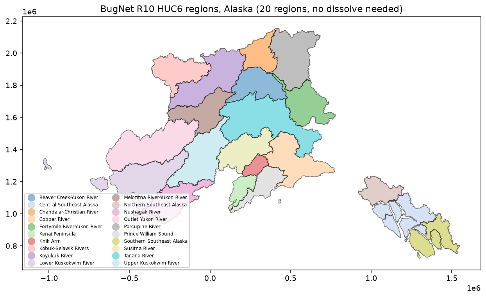

**Figure 11. ADS Region 10 observations and HUC6 project analysis subregions.** The 20 HUC6 watershed basins used as Task 1 analysis subregions.

### 6.3 Damage Causal Agent distribution

Region 10 contains a diverse DCA vocabulary with strong geographic structure. Aspen leafminer is the most prevalent agent dataset-wide, accounting for approximately 28% of attributed pixel-years, followed by spruce beetle at approximately 19%. Willow leaf blotchminer and western blackheaded budworm form a secondary group of relatively prevalent agents.

The dominant agents differ substantially across Alaska. Aspen leafminer is particularly prominent in interior and northern basins, including the Tanana, Porcupine, Koyukuk, and several Yukon River watersheds. Spruce beetle dominates several southcentral basins, including the Susitna River and Kenai Peninsula, and is also prominent in the Copper River basin. Western blackheaded budworm is the dominant attribution across several southeast and coastal basins.

Less prevalent agents at the Region 10 scale can nevertheless be important locally. Larch sawfly accounts for more than half of attributed pixel-years in the Upper Kuskokwim River basin despite ranking well below the leading agents dataset-wide. Birch leafroller similarly represents a substantial portion of attributed reference information in the Outlet Yukon River and Lower Kuskokwim River basins while contributing relatively little to the Region 10 total. These patterns illustrate the importance of retaining geographic context when evaluating the availability of reference information.

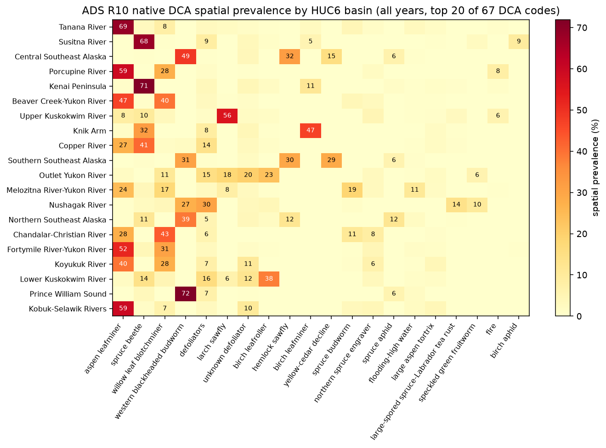

**Figure 12. Spatial prevalence of ADS Region 10 Damage Causal Agents by HUC6.** All years combined, top 20 of 67 DCA classes shown for legibility; percentages are not constrained to sum to 100% (Section 2.4). Cell color represents spatial prevalence. Numeric annotations are shown only for values greater than 5%; therefore, colored cells without a number can represent nonzero prevalence of 5% or less.

The source data contain 68 distinct named DCA classes. The quantitative HUC6 assessment contains 67 because the two source polygons attributed to Rhizosphaera needle disease of fir fall entirely outside the 20 project subregions. The source also contains 71 numeric DCA codes; three of those differences reflect historical code changes for otherwise equivalent named agents. The named DCA attribution, rather than the numeric code alone, is therefore used to characterize the native taxonomy in this assessment.

### 6.4 Temporal distribution

Region 10 contains attributed observations throughout the 1997–2025 record, with annual mapped area varying across the period and reaching its highest level in 2021. The temporal behavior of individual causal agents varies substantially among watersheds.

To summarize these patterns legibly across all 20 HUC6 basins, the report figure shows the annual spatial prevalence of each basin's single most prevalent DCA class. This highlights when the dominant attribution regime within each basin was most strongly represented. For example, spruce beetle becomes increasingly prominent in the Susitna River basin after approximately 2015, while aspen leafminer remains strongly represented across much of the Tanana River record.

The figure is intentionally a simplified view of the temporal data. Secondary and co-occurring agents are not shown, and the dominant class displayed for a basin should not be interpreted as its only attributed change agent. Full multi-class temporal distributions are retained in the supporting analysis.

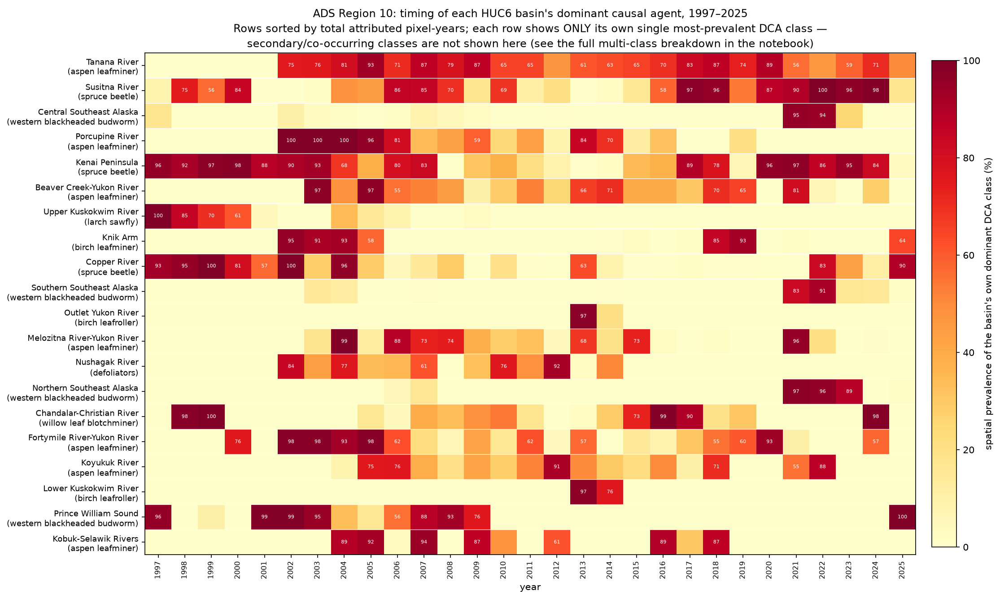

**Figure 13. Temporal prevalence of the dominant DCA class within each ADS Region 10 HUC6 basin.** Each row shows ONLY that basin's own single most-prevalent DCA class (named at left); secondary and co-occurring classes are not shown in this figure. The full multi-class breakdown for each basin is retained in the supporting notebook.

### 6.5 Damage Type as a complementary attribution

Region 10 contains 13 Damage Type classes. Unlike Region 6, where mortality dominates the broader Damage Type classification, the Region 10 reference information is predominantly associated with defoliation. Defoliation and its severity-specific categories collectively account for more than 70% of attributed pixel-years, while mortality represents approximately 22%.

This broader pattern is consistent with the prevalence of several defoliating insect agents in the DCA data. Damage Type therefore provides a useful complementary description of the observed effect, while DCA remains the primary taxonomy used to characterize causal attribution.

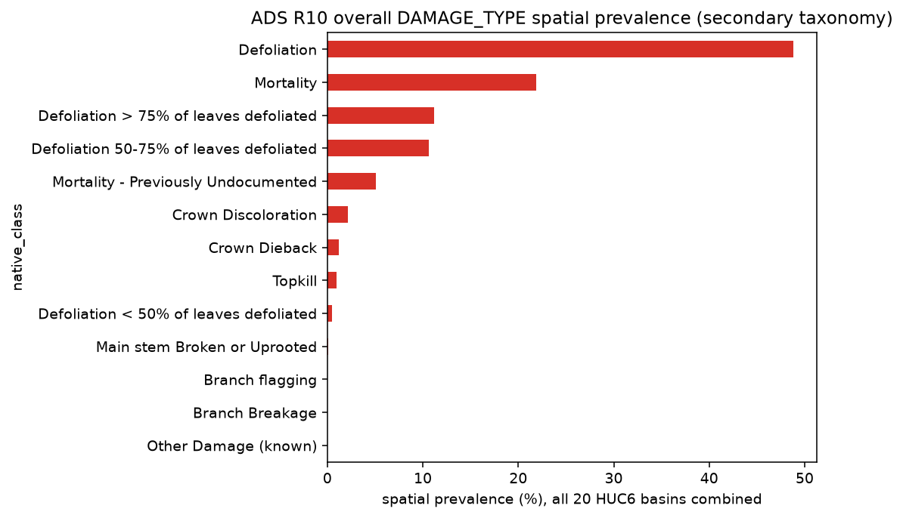

**Figure 14. Overall spatial prevalence of ADS Region 10 Damage Types.** All 20 HUC6 basins combined; secondary taxonomy, complementary to DCA.

### 6.6 Overlapping observations and rasterization

Approximately 2.0% of attributed Region 10 reference-grid pixels carry more than one DCA attribution within the same year. As in Region 6, much of this overlap reflects the ADS data structure in which multiple observations may share or overlap a mapped footprint. These attributions are preserved independently rather than reduced to a single class, so spatial-prevalence percentages are not constrained to sum to 100%.

Very small ADS geometries can also be omitted under pixel-center rasterization when they do not contain the center of a 30 m reference-grid pixel. Among 1,196 small polygons specifically evaluated for this condition, 174 produced no rasterized pixels. Twelve of those polygons were outside all 20 project subregions, leaving 162 within-subregion small polygons omitted by the pixel-center rule. These numbers describe the evaluated small-polygon subset and should not be interpreted as a dropout rate for the Region 10 dataset as a whole.

### 6.7 Considerations for downstream use

ADS Region 10 provides extensive annual reference information across a large and environmentally diverse geographic area. Its DCA observations show strong regional structure, with different agents dominating interior, southcentral, and southeast Alaska and with several comparatively uncommon Region-wide agents becoming important within individual watersheds.

The 20 HUC6 project subregions capture approximately 90.5% of the source attributed area. Consequently, the quantitative summaries do not represent the complete geographic extent of the Region 10 source dataset. Future focal-domain and sampling decisions should distinguish between properties of the complete source and those of the HUC6-characterized subset.

The distinction between numeric DCA codes and named causal agents also requires care when constructing downstream class definitions. Historical code changes result in more numeric codes than distinct named agents, while one named source class is absent from the HUC6 quantitative assessment because its observations occur outside the selected subregions.

Finally, the same survey-method considerations described for Region 6 apply here. ADS polygons represent observational mapping of visible damage rather than precise ground-surveyed boundaries, multiple attributions can occur at the same location, and absence of a mapped damage polygon does not establish either no damage or that a location was surveyed in a given year.

---

## 7. Cross-Source Assessment

### 7.1 Overall reference-data availability

The four reference sources provide a substantial but heterogeneous body of landscape-change attribution information. Together they span multiple decades, a wide range of disturbance processes, and markedly different geographic and methodological settings. The amount of available reference information also differs by more than two orders of magnitude among sources.

NCCN provides approximately 1.13 million attributed pixel-years across four park-based subregions, while GLKN provides approximately 4.08 million across seven parks. The ADS datasets are substantially larger: Region 6 contains approximately 196.4 million attributed pixel-years across seven ecoregions, and Region 10 contains approximately 95.7 million across 20 HUC6 basins.

These differences reflect the underlying monitoring programs and should not be interpreted as direct measures of dataset quality. NCCN and GLKN consist of comparatively targeted landscape-change interpretation efforts, while ADS is a broad-scale annual forest-health detection program with a much larger geographic footprint and different observational objectives.

**Table 7. Cross-source summary of reference information**

| Source | Native classes represented in Task 1 quantitative assessment |
|---|---|
| NCCN | 16 |
| GLKN | 10 |
| ADS Region 6 | 91 |
| ADS Region 10 | 67 |

Native-class counts refer to the classes represented in each source's Task 1 quantitative assessment. The attribution systems differ among sources and are not directly equivalent; source-specific taxonomy details are described in Sections 3–6.

Table 7 summarizes native-class counts at the source level. Table 8 extends this to the subregion level, providing a compact numerical view of the amount and composition of reference information available within each of the 38 subregions evaluated across the four sources. This table is descriptive: it summarizes the reference information currently available in each subregion to support the project's subsequent focal-domain selection (Task 2). It does not rank subregions, score their diversity, or identify a preferred or "best" location for later modeling work.

**Table 8. Per-subregion reference-data summary across all four sources**

| Source | Subregion | Attributed pixel-years | Native classes represented | Leading native class (%) | Second native class (%) | Third native class (%) |
|---|---|---|---|---|---|---|
| NCCN | MORA | 261,833 | 8 | Fire (74.2%) | Defoliation (21.5%) | Riparian Change (3.1%) |
| NCCN | NOCA | 524,866 | 8 | Fire (82.4%) | Defoliation (9.8%) | Avalanche (4.8%) |
| NCCN | OLYM | 84,385 | 10 | Fire (52.7%) | Riparian Change (21.4%) | Avalanche (11.9%) |
| NCCN | LEWI | 259,296 | 9 | Clearing (78.5%) | Windthrow Salvage (15.8%) | Tree Toppling (3.4%) |
| GLKN | APIS | 1,173,708 | 10 | harvest (49.0%) | insect_disease_defo (45.4%) | development (3.8%) |
| GLKN | INDU | 15,111 | 5 | development (77.1%) | harvest (9.9%) | unknown (7.5%) |
| GLKN | ISRO | 1,290,342 | 9 | harvest (49.2%) | insect_disease_defo (45.6%) | development (3.1%) |
| GLKN | MISS | 201,939 | 8 | development (98.7%) | agriculture (0.4%) | unknown (0.3%) |
| GLKN | SACN | 547,861 | 8 | harvest (75.5%) | development (20.5%) | blowdown (1.4%) |
| GLKN | SLBE | 195,965 | 7 | harvest (60.1%) | development (27.9%) | agriculture (7.6%) |
| GLKN | VOYA | 653,000 | 10 | harvest (87.3%) | insect_disease_defo (4.3%) | blowdown (3.4%) |
| ADS Region 6 | Blue Mountains | 38,875,415 | 48 | fir engraver (37.3%) | mountain pine beetle (16.9%) | western pine beetle (14.6%) |
| ADS Region 6 | Cascades | 30,176,076 | 63 | mountain pine beetle (24.4%) | bears (21.7%) | fir engraver (17.5%) |
| ADS Region 6 | Eastern Cascades Slopes and Foothills | 41,252,991 | 61 | mountain pine beetle (40.8%) | western spruce budworm (22.3%) | fir engraver (21.9%) |
| ADS Region 6 | Coast Range | 26,775,328 | 61 | Swiss needle cast (44.7%) | bears (35.4%) | unknown (4.0%) |
| ADS Region 6 | North Cascades | 32,797,665 | 60 | western spruce budworm (37.2%) | mountain pine beetle (28.0%) | fir engraver (8.2%) |
| ADS Region 6 | Northern Rockies | 18,937,156 | 56 | mountain pine beetle (22.4%) | fir engraver (22.2%) | western spruce budworm (17.6%) |
| ADS Region 6 | Klamath Mountains/California High North Coast Range | 7,568,432 | 48 | flatheaded fir borer (49.7%) | fir engraver (21.7%) | western pine beetle (15.0%) |
| ADS Region 10 | Tanana River | 21,594,522 | 39 | aspen leafminer (68.5%) | willow leaf blotchminer (7.7%) | spruce budworm (4.3%) |
| ADS Region 10 | Susitna River | 12,781,148 | 34 | spruce beetle (68.0%) | birch aphid (9.5%) | defoliators (8.5%) |
| ADS Region 10 | Central Southeast Alaska | 8,176,237 | 29 | western blackheaded budworm (48.8%) | hemlock sawfly (31.9%) | yellow-cedar decline (15.5%) |
| ADS Region 10 | Porcupine River | 7,458,390 | 22 | aspen leafminer (59.3%) | willow leaf blotchminer (27.6%) | fire (8.1%) |
| ADS Region 10 | Kenai Peninsula | 6,448,326 | 36 | spruce beetle (71.4%) | birch leafminer (11.4%) | unknown defoliator (3.9%) |
| ADS Region 10 | Beaver Creek-Yukon River | 6,127,694 | 31 | aspen leafminer (46.9%) | willow leaf blotchminer (39.7%) | spruce budworm (4.0%) |
| ADS Region 10 | Upper Kuskokwim River | 5,810,761 | 27 | larch sawfly (55.8%) | spruce beetle (9.9%) | aspen leafminer (8.2%) |
| ADS Region 10 | Knik Arm | 3,880,835 | 28 | birch leafminer (47.0%) | spruce beetle (32.3%) | defoliators (8.4%) |
| ADS Region 10 | Southern Southeast Alaska | 3,156,635 | 21 | western blackheaded budworm (30.6%) | hemlock sawfly (29.7%) | yellow-cedar decline (28.7%) |
| ADS Region 10 | Copper River | 3,110,013 | 32 | spruce beetle (41.1%) | aspen leafminer (27.1%) | defoliators (13.7%) |
| ADS Region 10 | Outlet Yukon River | 2,967,230 | 23 | birch leafroller (23.2%) | unknown defoliator (20.1%) | larch sawfly (17.8%) |
| ADS Region 10 | Melozitna River-Yukon River | 2,773,597 | 26 | aspen leafminer (24.5%) | spruce budworm (18.6%) | willow leaf blotchminer (17.5%) |
| ADS Region 10 | Nushagak River | 2,669,249 | 25 | defoliators (30.4%) | western blackheaded budworm (27.4%) | large-spored spruce-Labrador tea rust (13.7%) |
| ADS Region 10 | Northern Southeast Alaska | 2,091,624 | 39 | western blackheaded budworm (38.9%) | hemlock sawfly (12.0%) | spruce aphid (11.8%) |
| ADS Region 10 | Chandalar-Christian River | 1,940,278 | 22 | willow leaf blotchminer (43.0%) | aspen leafminer (27.7%) | spruce budworm (10.9%) |
| ADS Region 10 | Fortymile River-Yukon River | 1,331,358 | 28 | aspen leafminer (51.7%) | willow leaf blotchminer (30.9%) | northern spruce engraver (4.2%) |
| ADS Region 10 | Koyukuk River | 1,299,948 | 27 | aspen leafminer (39.6%) | willow leaf blotchminer (27.6%) | unknown defoliator (10.6%) |
| ADS Region 10 | Lower Kuskokwim River | 1,038,575 | 17 | birch leafroller (38.2%) | defoliators (16.0%) | spruce beetle (13.8%) |
| ADS Region 10 | Prince William Sound | 580,153 | 20 | western blackheaded budworm (71.9%) | defoliators (7.0%) | spruce aphid (5.5%) |
| ADS Region 10 | Kobuk-Selawik Rivers | 463,837 | 21 | aspen leafminer (59.5%) | unknown defoliator (10.2%) | willow leaf blotchminer (6.7%) |

Attributed pixel-years use the same unique per-subregion, per-year denominator as Sections 3–6: a pixel attributed to more than one native class in the same year is counted once, not once per class. Leading, second, and third native classes are drawn from the same all-years spatial-prevalence calculation underlying Figures 3, 6, 9, and 13; native-class counts reflect only classes with actual rasterized representation in that subregion. As elsewhere in this report, native terminology is preserved exactly and not harmonized across sources — GLKN's lowercase agent names (e.g., `harvest`, `insect_disease_defo`) and ADS's DCA common names are shown as they occur in the source-derived data. This table is reproducibly derived from `outputs/report/task1_master_pixel_summary.csv` and the corresponding per-subregion multi-label QA files (`src/build_subregion_results_table.py`; see Appendix A).

### 7.2 Differences in attribution structure

The four datasets do not describe landscape change in the same way. NCCN uses interpreted landscape-change classes representing processes such as fire, clearing, defoliation, avalanche, and riparian change. GLKN assigns causal agents to confirmed LandTrendr disturbance patches, with the ability to retain multiple agents for a disturbance. ADS uses a substantially larger Damage Causal Agent vocabulary and also records the broader type of observed vegetation damage.

Consequently, a native class in one source should not be assumed to represent the same concept or level of attribution as a class in another. The differences are methodological as well as terminological. NCCN and GLKN begin with remotely sensed change detection followed by interpretation, whereas ADS is principally an observational forest-health survey in which visible damage is mapped and attributed during repeated surveys.

For Task 1, preserving these native attribution systems provides a more accurate description of the available reference information than prematurely forcing the sources into a common taxonomy. Harmonization can instead be evaluated once focal domains and specific model attribution objectives have been established.

### 7.3 Spatial and temporal heterogeneity

All four sources show substantial variation in reference-data composition among subregions and through time. Dominant change classes or causal agents frequently differ among neighboring parks, ecoregions, or watersheds, and several classes that are uncommon at the regional scale become important within individual subregions.

The temporal distribution is similarly uneven. Some NCCN classes are concentrated in particular disturbance years, while GLKN shows changing mixtures of disturbance agents among parks through time. ADS provides more continuous annual coverage, but both the amount of mapped damage and the prevalence of individual causal agents vary substantially among years and locations.

This heterogeneity is important for subsequent model development because the composition of a training or evaluation sample will depend strongly on both the geographic domain and the time period from which observations are drawn. Dataset-wide class totals alone therefore do not fully describe the reference information available for a particular modeling experiment.

### 7.4 Multiple attribution and spatial representation

The sources also differ in the extent to which multiple labels can occur at the same location and time. Same-year multi-label attribution is uncommon in NCCN and in GLKN's primary-agent representation but occurs more frequently when additional GLKN agents are retained and is an inherent feature of the ADS observation structure. Region 6 has the highest multi-label rate among the four assessments, while Region 10 contains a smaller but still meaningful amount of overlapping attribution.

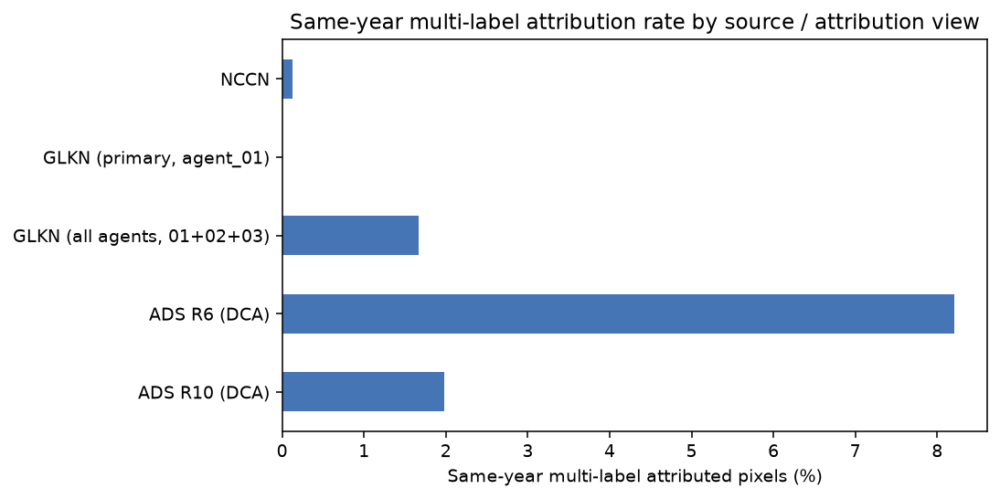

**Figure 15. Same-year multi-label attribution rate by source and attribution view.** Percentage of same-year attributed 30 m reference-grid pixels assigned more than one native-class label. Multiple native attributions are retained rather than forced into a single class, so these rates describe source attribution structure rather than error. GLKN primary (agent_01) is single-label by construction; the all-agents view additionally includes secondary and tertiary agents (Section 4.5). ADS values use DCA, the primary ADS taxonomy used in this assessment.

These differences reinforce the decision not to force the reference information into mutually exclusive classes during Task 1. Independent class rasterization preserves the attribution structure of the source datasets and allows later modeling decisions to determine whether multi-label observations should be retained, simplified, or excluded for a particular experiment.

The 30 m reference grid similarly provides a consistent basis for characterizing the source information without defining the final imagery or model sampling framework. Small source geometries can be omitted under pixel-center rasterization, particularly in ADS, and alignment with HLS and the eventual Prithvi chip framework remains a subsequent modeling decision.

### 7.5 Implications for subsequent project design

The assessment demonstrates that sufficient reference information exists to support a range of potential Prithvi change-attribution experiments, but that the available information is not uniform across sources, subregions, classes, or years. Each source offers a different combination of reference quantity, attribution detail, geographic coverage, and temporal representation.

These characteristics provide the basis for the next project tasks. Selection of focal domains can consider where the available reference information provides an appropriate mixture of change processes, temporal observations, and geographic conditions for the modeling questions of interest. Subsequent experimental design can then determine how native classes should be harmonized or grouped, how stable or no-change reference samples should be established independently, how multi-label observations should be handled, and how reference labels should be aligned with the imagery and Prithvi sampling framework.

Task 1 does not make those selections. Instead, it establishes the documented reference-data inventory needed to make them explicitly in the next phase of the project.

---

## 8. Limitations and Next Steps

### 8.1 Limitations of the reference-data assessment

This assessment provides a consistent characterization of the available reference information, but several limitations should be considered when using the results for subsequent model development.

First, the four sources were developed for different monitoring purposes and use different methods and attribution systems. Their native classes are therefore not directly interchangeable, and no attempt was made during Task 1 to harmonize them into a common modeling taxonomy. Differences in reference quantity among sources likewise reflect differences in monitoring design, geographic extent, and observation frequency and should not be interpreted as direct measures of reference-data quality.

Second, the assessment characterizes attributed change rather than wall-to-wall land-cover condition. Areas without an attributed polygon are not assumed to represent stable or no-change conditions. Stable-reference observations required for model training or evaluation will need to be established independently during subsequent experimental design.

Third, the 30 m reference grid used here was developed specifically to characterize the spatial and temporal distribution of the existing reference labels. It is not the final HLS, Landsat, or Prithvi sampling grid. The spatial relationship between reference labels, source imagery, and Prithvi-sized chips will need to be defined when the imagery and model-sampling pipeline is established.

Rasterization also introduces a scale-dependent representation of the source geometries. Small polygons that do not contain a 30 m pixel center may not be represented, while overlapping source observations can produce multiple valid labels for the same pixel and year. These behaviors were retained and documented rather than resolved through arbitrary class precedence or geometry modification.

Finally, the geographic subregions used for characterization do not have identical status across sources. NCCN and GLKN have source-specific study or analysis areas that provide documented context for their reference datasets. The ADS Region 6 ecoregions and Region 10 HUC6 basins are project analysis units adopted for Task 1 and are not established historical ADS survey extents. Consequently, the ADS subregion summaries characterize the portions of the source datasets intersecting those project boundaries rather than defining the complete geographic domain of the ADS programs.

### 8.2 Next steps

Task 1 establishes the reference-data inventory needed to proceed with the remaining work under the project's first objective. The next step is to use these results, together with partner monitoring needs, to identify representative focal domains and study periods for subsequent Prithvi experiments.

Once focal domains are established, the project can define the modeling problem more precisely: which change processes or attribution classes should be represented, whether and how native classes should be harmonized, how stable or no-change samples should be developed, how multiple attributions should be handled, and how training, validation, and evaluation observations should be separated.

The imagery and sampling framework can then be defined consistently with those decisions. This includes aligning reference information with the HLS imagery used in the Prithvi-EO-2.0 modeling framework (Kennedy, n.d.), determining appropriate chip dimensions and temporal inputs, and establishing the spatial and temporal sampling strategy for model development.

These decisions move beyond reference-data characterization into focal-domain selection, modeling constraints and success criteria, and experimental design. The Task 1 results provide the documented empirical basis for making those decisions without prescribing them in advance.

---

## 9. Appendices

### Appendix A. Reproducible Analysis and Supporting Detail

This report presents the principal Task 1 findings. The complete reproducible analysis, detailed QA, and full class-by-year and class-by-subregion results are maintained in the project repository and analytical notebook, rather than reproduced here.

| Topic | Supporting material |
|---|---|
| Complete reproducible Task 1 analysis | `notebooks/reference_data_assessment.ipynb` |
| Master per-subregion, per-class pixel-summary table (all four sources, all-years) | `outputs/report/task1_master_pixel_summary.csv`, built by `src/build_master_pixel_summary.py`; Table 8's per-subregion denominators and leading classes are derived from this file by `src/build_subregion_results_table.py` |
| 30 m reference-grid and rasterization parameters | `src/rasterize_common.py`; `outputs/qa/nccn_rasterize_metadata.json`, `glkn_rasterize_metadata.json`, `ads_r6_rasterize_metadata.json`, `ads_r10_rasterize_metadata.json` |
| NCCN study-area generation mapping and containment QA | Notebook Appendix A.6; `outputs/qa/nccn_aoi_generation_mapping_qa.csv`, `nccn_aoi_generation_mapping_outside_polygons.csv`, `nccn_natasha_aoi_containment_qa.csv` |
| GLKN LandTrendr analysis-area provenance and containment QA | Notebook Appendix B.6; `outputs/qa/glkn_landtrendr_aoi_containment_qa.csv`, `nccn_glkn_aoi_total_pixel_counts.csv`, `nccn_glkn_aoi_constraint_comparison_subregion.csv`, `nccn_glkn_aoi_constraint_comparison_class.csv` |
| Complete R6 and R10 DCA distributions | `outputs/qa/ads_r6_dca_subregion_class_summary.csv`, `outputs/qa/ads_r10_dca_subregion_class_summary.csv` |
| Detailed subregion × year × native-class results (all four sources) | `outputs/qa/nccn_subregion_year_class_summary.csv`; `glkn_primary_subregion_year_class_summary.csv` and `glkn_allagents_subregion_year_class_summary.csv`; `ads_r6_dca_subregion_year_class_summary.csv` and `ads_r6_damagetype_subregion_year_class_summary.csv`; `ads_r10_dca_subregion_year_class_summary.csv` and `ads_r10_damagetype_subregion_year_class_summary.csv` |
| ADS overlap / multi-label investigation | Notebook ADS Region 6 and Region 10 source-characterization and grid-assessment sections; `outputs/qa/ads_r6_subregion_year_dca_multilabel_qa.csv`, `ads_r10_subregion_year_dca_multilabel_qa.csv` (and the corresponding Damage Type multi-label QA files) |
| Small-polygon rasterization QA | `outputs/qa/ads_r6_zero_pixel_polygons.csv`, `outputs/qa/ads_r10_zero_pixel_polygons.csv` |

---

## References

Antonova, N., Copass, C., & Clary, S. (2013). *Landsat-based monitoring of landscape dynamics in the North Cascades National Park Service Complex: 1985–2009* (Natural Resource Data Series NPS/NCCN/NRDS—2013/532). National Park Service, Fort Collins, Colorado.

Copass, C., & Antonova, N. (2019). *Landsat-based monitoring of landscape change in Lewis and Clark National Historical Park: 1985–2011* (Natural Resource Data Series NPS/NCCN/NRDS—2019/1206). National Park Service, Fort Collins, Colorado.

NCCN, Antonova, N., & Copass, C. (2022). *NCCN landscape change monitoring polygons in and around Mount Rainier, North Cascades, and Olympic National Parks for 1987–2017*. North Coast and Cascades Network, National Park Service. https://irma.nps.gov/DataStore/Reference/Profile/2294375

Kirschbaum, A. (2024). *Landscape disturbances delineated and validated in and around nine national parks within the Great Lakes network* [Geospatial dataset metadata]. National Park Service, Great Lakes Inventory & Monitoring Network.

USDA Forest Service, Forest Health Assessment and Applied Sciences Team. (2025). *GIS handbook and data conformity standards*. U.S. Department of Agriculture, Forest Service.

Kennedy, R. (n.d.). *A Prithvi-based landscape change attribution service in support of National Park Service and National Forest monitoring needs*. Oregon State University. NASA project proposal.
